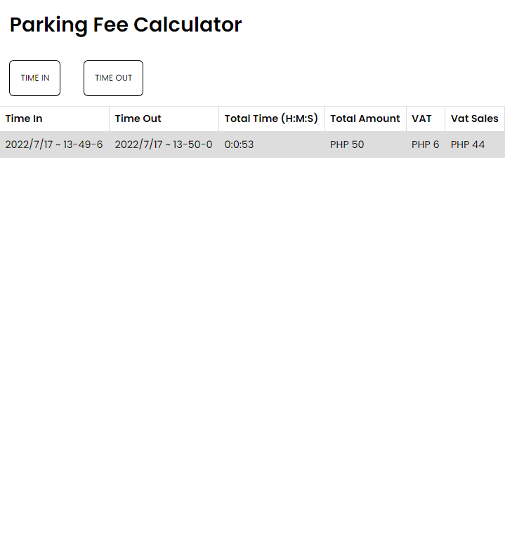

# Parking Fee Calculator

## Description

This parking fee calculator project is a Web-Based Program using HTML5, CSS3, and Javascript. After reading this documentation, you will be able to create and customize your own parking fee calculator.

## Todo
* The program shall accept Date & Time details containing the parker's entry timestamp. 
* The program shall then compute and display for the time consumed from the parker's entry up to the current time.
* The parking fee computation is:
    - First 3 hours: 50pesos, succeeding hours : 10pesos. (A fraction of an hour is considered an hour, i.e. 2minutes is equivalent to plus 1 hour)
* The program shall display the total amount to be paid by the parker
* The program shall compute for the VAT-Sales and VAT amount of the total parking fee (VAT=Total Amount × 12%      VatSales=Total Amount -VAT)


## Development Process

#### First, create an index.html file and write the html boilerplate as seen below.

```
    <!DOCTYPE html>
    <html lang="en">
    <head>
        <meta charset="UTF-8">
        <meta http-equiv="X-UA-Compatible" content="IE=edge">
        <meta name="viewport" content="width=device-width, initial-scale=1.0">
        <title>Document</title>
    </head>
    <body>
        
    </body>
    </html>
```
#### Next, we should add all the tags that we needed. 

Create an h1 file for the title, buttons for the Time in and Time out, and table we can use for the outline of all data we need to show. Since we're only making a simple project, we will only be writing on the rows of each column. We used tables so we can customize it later and we can use `append` and `appendChild` to the elements instead.

```
    <body>
        <h1>Parking Fee Calculator</h1>
        <button id="time-in">
            TIME IN
        </button>
        <button id="time-out">
            TIME OUT
        </button>
        <table>
            <tr>
                <th>Time In</th>
                <th>Time Out</th>
                <th>Total Time (H:M:S)</th>
                <th>Total Amount</th>
                <th>VAT</th>
                <th>Vat Sales</th>
            </tr>
            <tr>
                <td id="appendTimeIn"></td>
                <td id="appendTimeOut"></td>
                <td id="appendTotalTime"></td>
                <td id="appendAmount"></td>
                <td id="appendVAT"></td>
                <td id="appendVatSales"></td>
            </tr>
        </table>
    </body>
```

#### After that, we need to style our program. Create a style.css file. Copy and paste the code shown below to your program.


We only need basic styling as we're only required to show the logic of the whole program and to make sure it is running.
```
    *,
    *::before,
    *::after {
        margin: 0;
        padding: 0;
        box-sizing: border-box;
        font-family: 'Poppins', sans-serif;
    }

    h1 {
        margin: 1rem;
    }

    button {
        cursor: pointer;
        padding: 1rem;
        margin: 1rem;
        background-color: transparent;
        border-radius: 5pt;
    }

    button:hover {
        background-color: gainsboro;
    }

    table {
        font-family: arial, sans-serif;
        border-collapse: collapse;
        width: 100%;
    }

    td, th {
        border: 1px solid #dddddd;
        text-align: left;
        padding: 8px;
    }

    tr:nth-child(even) {
        background-color: #dddddd;
    }
```

## Initial result

### Here's the image of the program with our HTML and CSS.


### Finally, we'll be creating the logic behind the parking fee calculator and on how we are gonna show it to our webpage.

First, we need to get all the DOM elements that we need to manipulate the tags that we're going to use.

```
    // Get all DOM elements to manipulate
    let timeIn = document.querySelector("#time-in")
    let timeOut = document.querySelector("#time-out")
    const appendTimeIn = document.querySelector('#appendTimeIn')
    const appendTimeOut = document.querySelector('#appendTimeOut')
    const appendTotal = document.querySelector('#appendTotalTime')
    const appendAmount = document.querySelector('#appendAmount')
    const appendVAT = document.querySelector('#appendVAT')
    const appendVatSales = document.querySelector('#appendVatSales')


    let difference
    let VAT, VatSales 

```

Next, we should first create a function to get the current time. To be able to do this, we need to use the built in Date objects.

```
// Get time now function and return all data collected
const getTime = () => {

    // Gets current date
    let timeNow = new Date()
    
    // Get all the information we need
    let year = timeNow.getFullYear()
    let month = timeNow.getMonth()
    let day = timeNow.getDay()
    let hour = timeNow.getHours()
    let minute = timeNow.getMinutes()
    let second = timeNow.getSeconds()

    // Return the value to access then when showing timestamps
    return {
        timeNow,
        year, month,day,
        hour,minute, second
    }
} 

```

After using the build in Date object and methods, we will create a function named convert that will take a parameter called `milliseconds`. We will be using this to convert all the milliseconds that passed between the time in and time out. 

We also need to consider that if the time is less than or equal to 3, we need to use the `Math.floor` method since we're only gonna charge PHP 50 for the first three hours. And then we will be charging PHP 10 more for proceeding hours. We can now then use the `Math.ceil` method to round up the extra minutes and convert it into an hour.

```
    // Convert milliseconds to time respectively
    const convert = milliseconds => {
        let seconds = Math.floor(milliseconds / 1000)
        let minutes = Math.floor(seconds / 60)
        
        // If number of hours is 3, get the floor
        // Proceeding hours will apply fraction of hour ceil
        let hours = minutes < 180 ? Math.floor(minutes / 60) : Math.ceil(minutes / 60)
    
        seconds %= 60
        minutes %= 60
        hours %= 24

        appendTotal.innerHTML = (`${hours}:${minutes}:${seconds}`)
        compute(hours)
    }
```

You can notice that there's a `compute()` function in the last part of the code. It will be explained after the next part.

Then we need to access them and be used by our buttons. To do this, we need to add an event to our buttons in a callback function so that we can show the time whenever we click the corresponding buttons.

```
    // Get time in date
    timeIn.addEventListener('click', _ => {
        const { timeNow,
            year, month,day,
            hour,minute, second
        } = getTime()

        timeIn = timeNow
        appendTimeIn.innerHTML = (`${year}/${month}/${day}  ${hour}-${minute}-${second}`)

    })

    // Get time out date
    timeOut.addEventListener('click', _ => {
        const { timeNow,
            year, month,day,
            hour,minute, second
        } = getTime()
        timeOut = timeNow

        appendTimeOut.innerHTML = (`${year}/${month}/${day}  ${hour}-${minute}-${second}`)
        
        // Get time difference
        difference = Math.abs(timeIn - timeOut)

        convert(difference)
    })

```

You can notice that we used deconstruction to access all the variables that we need. You can also see that we invoked the function `convert()` inside the `timeOut` event. This is because we need to convert all the milliseconds between those two timestamps to proceed to the the computation of the total amount, the VAT, and the Vat Sales.


Lastly, we then need to create a function called `compute()` to finally compute all the total. After that, you can now append or insert all the texts we need to the corresponding table rows.

```
    const compute = hours => {
        let amount

        // If num of hours is less than 3
        // Total is 50
        if(hours <= 3) {
            amount = 50
        } else if (hours > 3) { // If num hours is more than 3
            // Total is 50 + 10 pesos per additional hour
            hours -= 3
            amount = hours * 10
            amount += 50
        }

        VAT = amount * .12
        VatSales = amount - VAT

        // Add
        appendAmount.innerHTML = `PHP ${amount}`
        appendVAT.innerHTML = `PHP ${VAT}`
        appendVatSales.innerHTML = `PHP ${VatSales}`
    }

```


## Result

### Here's the full image of the program working.

